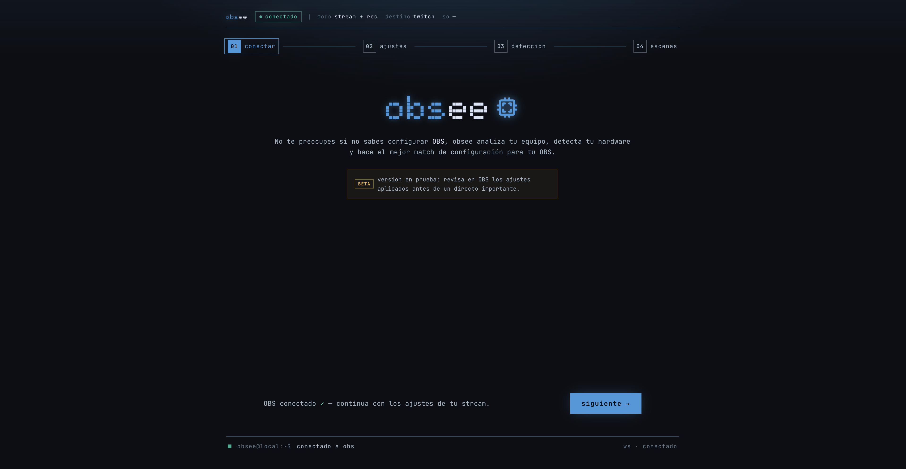

# obsee



**obsee** es una app web que configura OBS Studio por ti. Analiza tu computadora, pide a una IA la mejor configuración de stream/grabación para tu hardware, te muestra **qué va a cambiar y por qué**, y la aplica a OBS con un clic.

## Propósito

OBS ya trae un asistente de auto-configuración, pero funciona como caja negra: prueba, decide y aplica sin explicar nada. obsee apunta a lo contrario — que entiendas tu configuración:

- Explica **por qué** cada ajuste tiene sentido para tu equipo.
- Muestra un **diff** entre tu configuración actual y la recomendada antes de tocar nada.
- Te deja **editar** la recomendación, y la IA re-explica el impacto de tus cambios.
- Guarda un **respaldo** de tu configuración anterior para restaurarla cuando quieras.

## Setup

**Como usuario**: OBS Studio abierto en la misma computadora con el servidor WebSocket activado (`Herramientas → Ajustes del servidor WebSocket`) y un navegador Chrome, Edge o Firefox (Safari bloquea la conexión local con OBS).

**Como desarrollador**:

```bash
pnpm install
ollama pull gpt-oss:20b
pnpm dev          # abre http://localhost:5173 con IA local de Ollama
pnpm test         # suite de Vitest
pnpm typecheck && pnpm lint
pnpm build        # build de producción en dist/
```

Ollama debe estar ejecutándose en `http://127.0.0.1:11434`. `pnpm dev` usa `.env.ollama`, atiende las funciones `/api` dentro de Vite y no consume Groq ni el límite diario de producción. Si `gpt-oss:20b` resulta demasiado pesado para tu equipo, cambia `OLLAMA_MODEL` en `.env.ollama` por un modelo local más pequeño que siga instrucciones JSON. Para contrastar consolas, capturadoras y micrófonos con fuentes web reales durante estas pruebas, configura `TAVILY_API_KEY` en `.env.ollama.local`; la clave permanece en el proceso local de Vite y nunca se expone al navegador.

Para probar deliberadamente contra la API desplegada usa `pnpm run dev:remote`; ese comando sí consume la cuota real. Las claves (`GROQ_API_KEY`, `TAVILY_API_KEY`, rate limits) viven **solo** en las variables de entorno de Vercel — el frontend no contiene secretos.

### Seguridad de la API desplegada

Los endpoints de IA aceptan únicamente `POST` con `Content-Type: application/json`. Los navegadores también deben enviar un `Origin` permitido. `https://obsee.vercel.app`, `http://localhost:5173` y `http://127.0.0.1:5173` están incluidos; previews o dominios propios se agregan como orígenes exactos, separados por comas, en `OBSREC_ALLOWED_ORIGINS`. No se admiten comodines.

Toda implementación de producción con Groq/Tavily requiere `UPSTASH_REDIS_REST_URL` y `UPSTASH_REDIS_REST_TOKEN`. Si cualquiera falta o Upstash no responde, la IA remota falla de forma segura y la aplicación utiliza su recomendación local. `OBSREC_ALLOW_MEMORY_RATE_LIMIT=true` sólo habilita un contador temporal durante desarrollo local; Vercel y `NODE_ENV=production` siempre ignoran esa opción. `OBSREC_AI_DAILY_LIMIT` acepta enteros de 1 a 1000 y vuelve al valor seguro 20 si la configuración no es válida.

Producción también envía una Content Security Policy estricta como header. `pnpm run security:csp` comprueba sus directivas, el hash exacto del JSON-LD de SEO, la conexión WebSocket limitada a localhost y la ausencia de scripts inline inesperados antes del build de Vercel.

## Arquitectura y decisiones

```text
navegador ──ws://localhost:4455──> OBS Studio        (control directo, nunca sale de tu PC)
navegador ──HTTPS──> funciones serverless en Vercel  (IA: Groq + búsqueda web Tavily)
navegador ──HTTP local──> Vite ──> Ollama             (desarrollo sin cuota externa)
```

Stack: React 19 + Vite + TypeScript + Tailwind + Zustand; `obs-websocket-js` en el navegador; funciones serverless en Vercel (`api/`) con Groq y Tavily.

```text
src/renderer/       interfaz React
src/renderer/lib/   integración OBS WebSocket, detección de hardware, cliente de IA
src/shared/         tipos, validadores y motor de recomendación local
api/                endpoints serverless de IA (Vercel)
```

Decisiones vigentes:

- **La conexión con OBS es 100% local.** El navegador habla con el servidor WebSocket de OBS en tu misma máquina. Tu password de OBS, tus escenas y tu configuración nunca pasan por internet; a la IA solo viajan specs anónimas de hardware (CPU, GPU, RAM, SO).
- **Detección de hardware híbrida**: la GPU se estima vía WebGL y el navegador aporta pistas limitadas de CPU/RAM; el usuario confirma modelo, núcleos y RAM en un formulario versionado en `localStorage` porque esas APIs no son un inventario fiable.
- **Nunca sin respuesta**: si la IA no está disponible (sin red, límite diario), un motor de recomendación local genera la configuración.
- **IA local durante desarrollo**: Vite ejecuta los mismos handlers de `api/` contra Ollama; Groq solo se usa en producción o con `pnpm run dev:remote`.
- **Respaldo antes de tocar**: la configuración actual de OBS se guarda en `localStorage` y se puede restaurar desde la pestaña de comparación.
- **Flujo guiado en 4 pasos**: conectar → ajustes (hardware, modo, plataforma) → detección (recomendación + audio) → escenas (con vista previa en vivo).
- **Perfilado de consolas** (PS5/Xbox/Switch): detecta tu capturadora, lee sus capacidades reales desde OBS y recomienda la cadena de captura completa.


- **CSP vs `assetsInlineLimit` de Vite**: Vite incrusta assets < 4 KB como `data:` URIs, y una CSP con `default-src 'self'` sin `font-src` los bloquea — solo en producción, porque el dev server no incrusta. Fix: `assetsInlineLimit: 0`. → [apuntes](docs/apuntes.md#csp--vite-assetsinlinelimit-por-qué-las-fuentes-se-veían-en-local-pero-no-en-producción)
- **`ws://localhost` desde HTTPS**: localhost es un "origen potencialmente confiable", exento de la regla de mixed content (excepto en Safari); IPs de LAN sí se bloquean — por eso obsee solo controla el OBS local. → [apuntes](docs/apuntes.md#websocket-a-wslocalhost-desde-una-página-https)
- **Detección de hardware en navegador**: la GPU llega envuelta en un string ANGLE que hay que parsear; `deviceMemory` satura en 8 GB por anti-fingerprinting; `enumerateDevices()` no da labels sin permiso de cámara previo. → [apuntes](docs/apuntes.md#detección-de-hardware-desde-el-navegador-qué-se-puede-y-qué-no)
- **Patrón adapter en la migración**: `appAPI` conservó la forma exacta del viejo `window.electronAPI`, así que cambiar Electron por navegador tocó una sola costura, no toda la UI. → [apuntes](docs/apuntes.md#de-ipc-de-electron-a-un-módulo-del-navegador-la-costura-appapi)
- **Proxy de Vite contra CORS**: en dev, `/api` se reenvía a producción para que el navegador vea same-origin y no dispare preflight por el header custom. → [apuntes](docs/apuntes.md#proxy-de-vite-en-dev-esquivar-cors-sin-tocar-el-backend)
- **Regla `VITE_*`**: toda variable con ese prefijo se incrusta en el bundle público; los secretos viven solo en el serverless. → [apuntes](docs/apuntes.md#secretos-en-apps-frontend-la-regla-vite_)


GitHub: <https://github.com/AlanSan1195/obsee>
